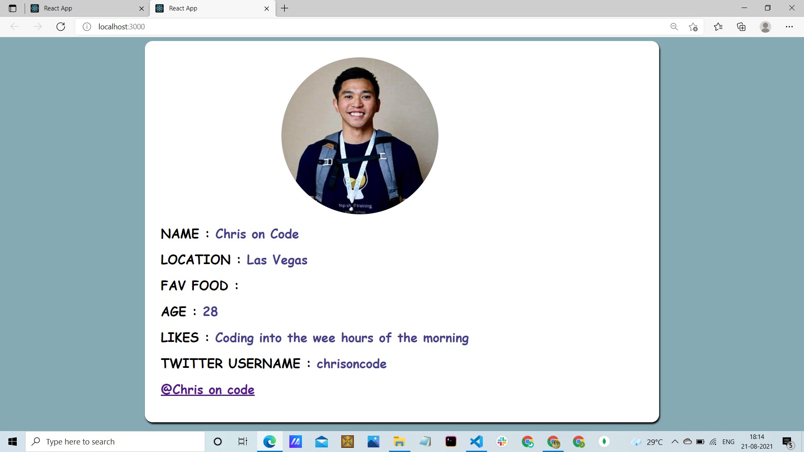
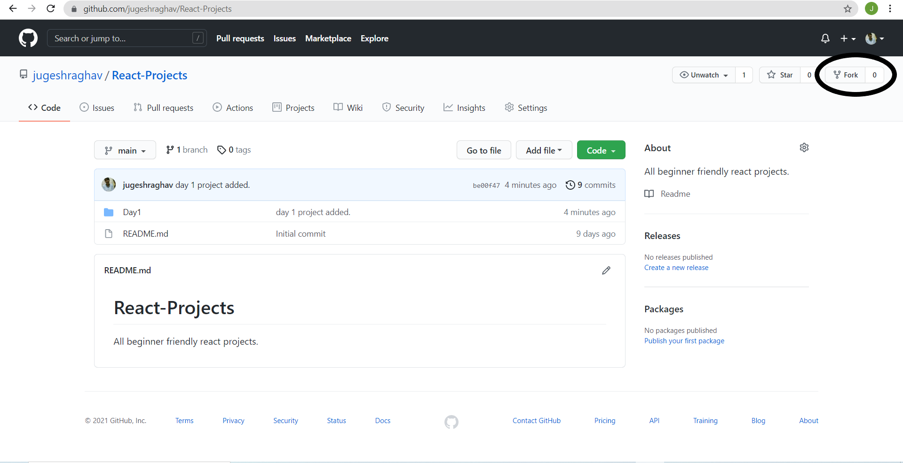

# Project 1 (Day 1)
It is a project in order to learn the basic concepts of ReactJS. In this project we have only used some data to display on the browser. 

# Default view 


# Tech Used:

## How to view the project on your local machine:
### 1. fork the repository 
Click on the fork button and the repository will be forked to your github.


### 2. clone the repository using the following command.
```
git clone <your forked repository url>
```

### 3. open the folder using any IDE(I prefer VScode)
### 4. go to the respective directory 
### 5. run the following command
```
npm start
```


# Want to join us in our 10 days challenge
If you wish to learn the basic concepts of ReactJs, then join us in our 10 days challenge. The challenge may exceed 10 days because we are focusing to learn all the basic concepts of react and deep diving into them by doing projects. If you wish to learn with us then just connect with me on linkedin and DM me : https://www.linkedin.com/in/jugesh-raghav-7895551a2/

# Happy Coding 😀